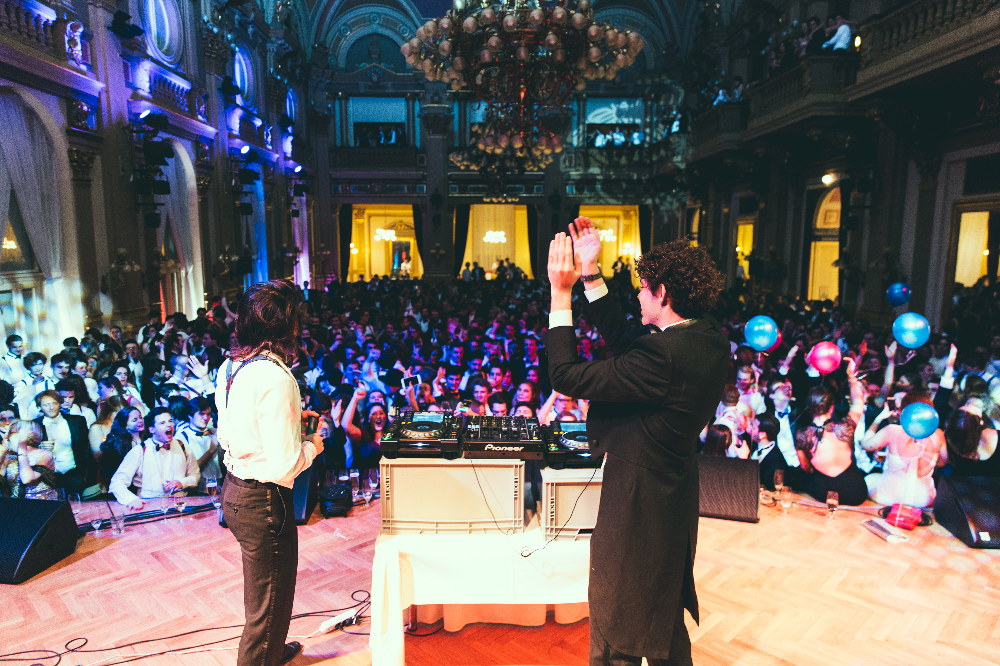

export const commissie = [
  {
    function: "Voorzitter",
    name: "Tijmen Mulder",
  },
  {
    function: "Secretaris",
    name: "Laura Guleij",
  },
  {
    function: "Penningsmeester",
    name: "Thijs van den Bosch",
  },
  {
    function: "Commissaris Bands & Acts",
    name: "Piet van Beek",
  },
  {
    function: "Commissaris Logistiek",
    name: "Esmée te Velde",
  },
  {
    function: "Commissaris Promo",
    name: "Charlotte Blankensteijn",
  },
];

import { graphql } from "gatsby";
import { getColorByID } from "../../components/utils";

export const query = graphql`
  {
    mdx(frontmatter: { slug: { eq: "/memories/gala" } }) {
      fileAbsolutePath
      frontmatter {
        commiteePhoto {
          publicURL
          childImageSharp {
            fluid(maxWidth: 800) {
              ...GatsbyImageSharpFluid
            }
          }
        }
      }
    }
  }
`;

<Introduction
  color={getColorByID(props.pageContext.frontmatter.eventID)}
  title={props.pageContext.frontmatter.title}
>
  Feesten op Virgiel zijn altijd leuk, maar gala's zijn uniek. Een lustrum gala
  moet daarom dus nog specialer zijn. De lat lag hoog aangezien locaties zoals
  het kasteel van Versailles, paleis Liechtenstein en nog tal aan prachtige
  locaties overtroffen moesten worden. Na maanden zoeken is het de Lustrum Gala
  Commissie gelukt om de perfecte locatie te vinden voor het lustrum gala van
  het 24e lustrum. Dit jaar vond het gala plaats in een van de mooiste steden
  van Europa: Praag. Op 16 december opende het National House of Vinohrady haar
  deuren voor een groep van 1200 mensen bestaande uit Virgilianen, reünisten en
  dates. Overdag was er de gelegenheid om met je date de stad te verkennen, een
  wandeling langs de Donau te maken en een hapje te gaan eten in de oude
  binnenstad. ‘s Avonds maakte iedereen zich klaar voor een avond vol klasse en
  spektakel die ervoor zorgde dat iedereen zijn date en het 24e lustrum van de
  KSVSV nooit meer zou vergeten.
</Introduction>

<Committee
  commiteeName="Gala Commissie"
  members={commissie}
  image={props.data.mdx.frontmatter.commiteePhoto}
/>

<MediaHighlighter event={props.pageContext.frontmatter.eventID} />

## Vanuit de Gala Commissie

Als Gala Commissie was het extra spannend om het spits af te bijten. Het enige
dat we wisten, maar wat we bijna niet durfden te hopen, was dat het gala dan
ook als knallende opening misschien wel het hoogtepunt van het lustrum zou
worden. De meeste van ons maken een lustrum gala maar 1 keer mee, wat het
organiseren van dit gala extra speciaal maakte.

<Blockquote align="right">
  "Als Gala Commissie was het extra spannend om het spits af te bijten."
</Blockquote>

Met 6 relatief jonge enthousiaste Virgilianen zo in het diepe gegooid worden
was verschrikkelijk gaaf om te ervaren. Na er bijna een jaar voor te hebben
gewerkt, was het gek om in Praag te staan. Het enthousiasme dat je terugkrijgt
van Virgilianen is fantastisch en is het ook mooie aan deze vereniging. We
hebben genoten van het weekend in Praag. Van de tequila shots en het dansen in
een nog lege Karlovy Lazne op vrijdag tot de prachtige geklede Virgilianen en
fantastische sfeer op het gala op zaterdag.

<Blockquote align="left">
  "Het enthousiasme dat je terugkrijgt van Virgilianen is fantastisch en is ook
  het mooie aan deze vereniging."
</Blockquote>

We hebben met een ontzettend leuke groep een gala mogen organiseren in de prachtige stad Praag waarbij zelfs toko
mensen zich redelijk lang chique wisten te gedragen. Een feest dat wij, en
hopelijk vele anderen, niet snel meer zullen vergeten.

<Feedback filePath={props.data.mdx.fileAbsolutePath} />
